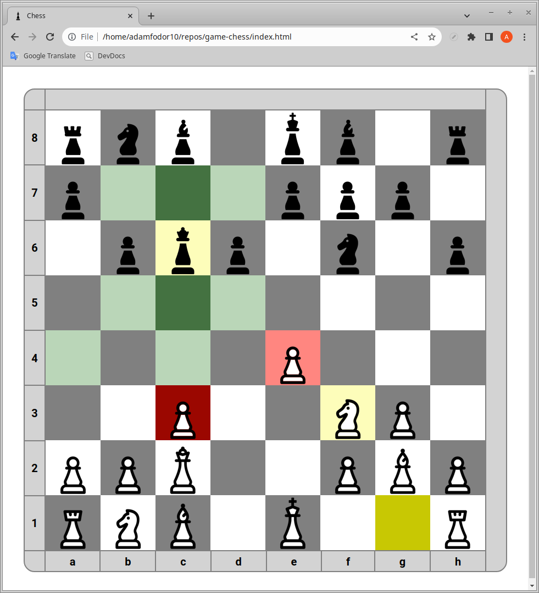

# Chess Game
In this project I am building a chess game which can be played by 2 people taking turns. The core of the project is the chess logic which is implemented by JavaScript fundamentals and the interactivity of the game which is achieved mainly by event listeners and DOM manipulation. This project has not been finished yet.

Check out the game at: https://adamfodor10.github.io/game-chess/

## Chess rules not yet implemented:
- Check
- Checkmate
- Draw by stalemate
- Draw by repetition
- Draw by insufficient material
- Castling
- Promotion
- En passant

## Planned features:
- Timer (losing on time)
- Chess engine (playing against the computer)
- Playing against a friend online instead of in-person

## Credit for the icons goes to:
- [Adrien Coquet](https://thenounproject.com/icon/chess-4220159/)
- [Adrien Coquet](https://thenounproject.com/icon/chess-4220166/)

## Credit for the sounds goes to:
- [lichess.org](https://github.com/lichess-org/lila/tree/master) (sounds are located in the ./public/sound folder)

## Screenshots of the game:

